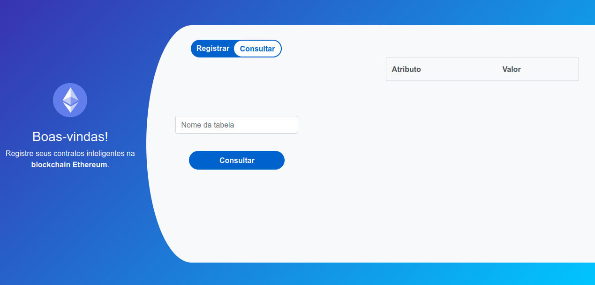

# blockchain-ethereum

> Registro e Consulta de Tabelas na blockchain Ethereum por meio de um contrato inteligente

Projeto desenvolvido para a disciplina Administração e Gerência de Redes de Computadores do curso Ciência da Computação.

Front-end da aplicação.

