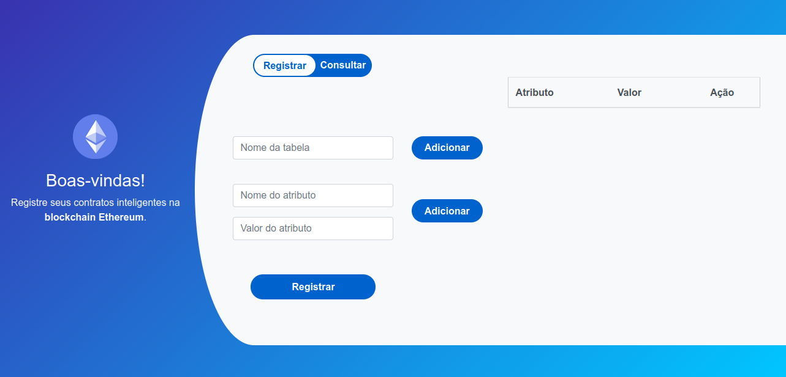

# blockchain-ethereum

> Registro e Consulta de Contratos Inteligentes na blockchain Ethereum

Projeto desenvolvido para a disciplina Administração e Gerência de Redes de Computadores do curso Ciência da Computação.

